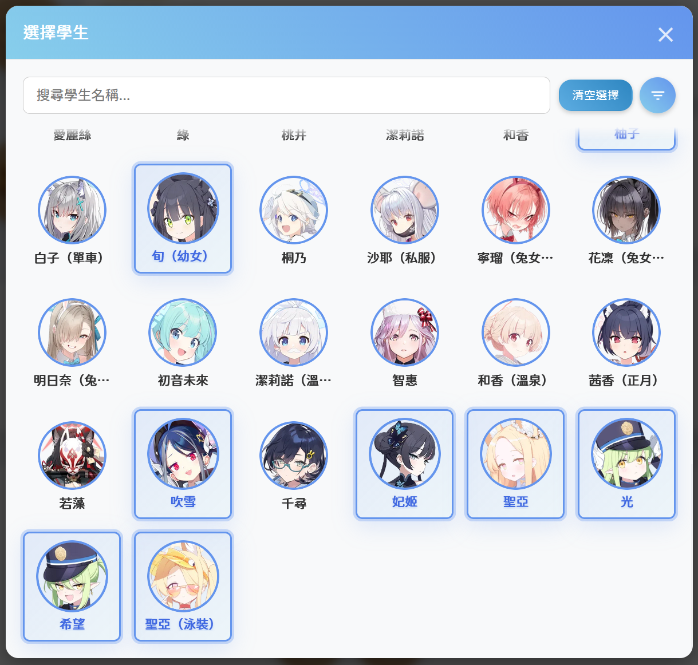
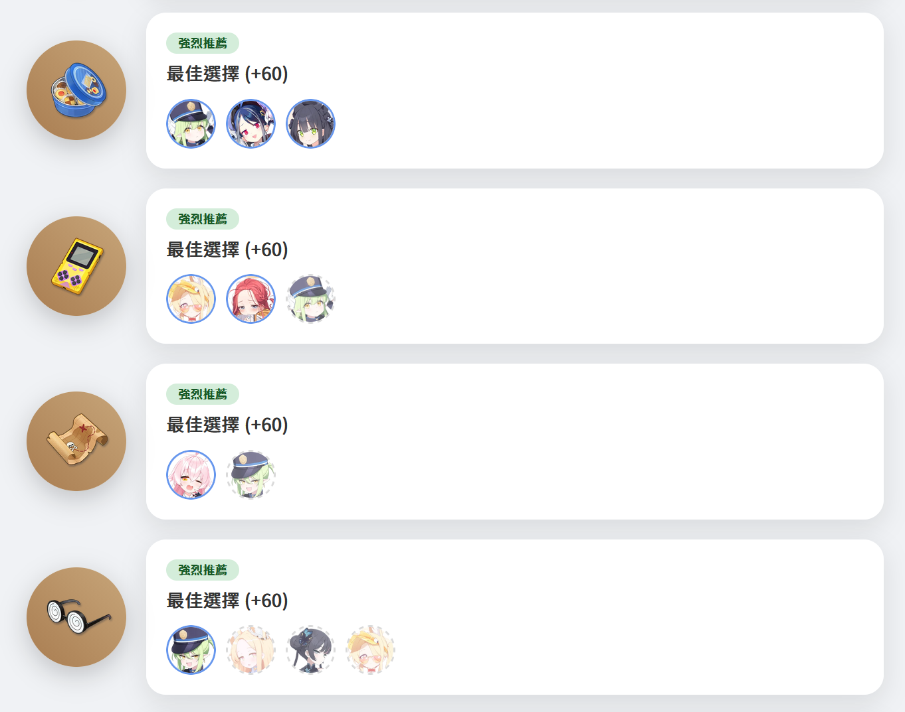
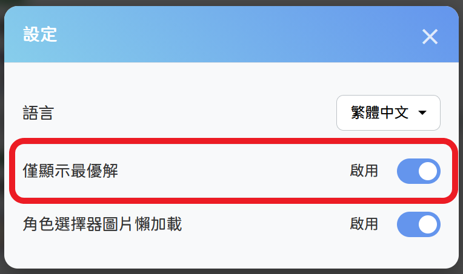
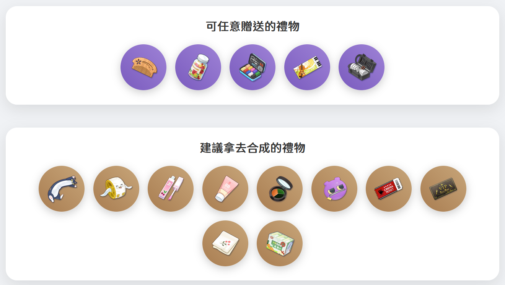

<p>
  English | 
  <a href="./docs/README.zh-TW.md">繁體中文</a> | 
  <a href="./docs/README.zh-CN.md">简体中文</a> | 
  <a href="./docs/README.ja.md">日本語</a> |
  <a href="./docs/README.ko.md">한국어</a>
</p>

# BA Gift Planner - Blue Archive Gift Planner

<p align="left">
  <a href="https://vuejs.org/"></a>
  <a href="https://vitejs.dev/"></a>
  <a href="https://opensource.org/licenses/MIT"></a>
</p>

This is a gift planner designed for players of the mobile game "Blue Archive". Built with Vue 3 and Vite, this project provides a clean, fast, and responsive interface to help players quickly find the optimal gifting strategy for the students whose bond levels they want to increase. All information and materials used on this website are the property and copyright of their respective authors.

**[➡️ Click here to visit the website](https://ba-gift-planner.pages.dev/)**


> [!NOTE]
> You might notice that this website has two names: BA Gift Planner and Sensei Harem Tool. BA Gift Planner was the tentative name in the early stages of the project, and I am still considering which name to unify it under.

---

## ✨ Key Features

> [!NOTE]
> The screenshot version is v0.3.2. Please forgive me for not having an English interface for the screenshots at the moment. The current plan is to support Traditional Chinese, Simplified Chinese (both already supported), English, Japanese, and Korean. If you would like to help me add these or other languages, please submit a [PR](https://github.com/Yuuzi261/BA-Gift-Planner/pulls).

1️⃣ Open the character selector and choose your ~~waifus😋~~... I mean, students.



2️⃣ Close the character selector to see the results (yes, it's that simple!). Here, I'm only showing a part of the results.



Students who are not the best choice will have a semi-transparent + dashed border effect. If you don't want to see non-optimal choices, you can change the settings in the settings interface:



3️⃣ Check which gifts can be given freely (SSR) or used to craft a Gift Selection Box (SR).



4️⃣ Alright, now you can open the game and start building relationships with your students. No more worrying about giving the wrong gift or not knowing which gifts can be used for crafting! 🎉

## 🛠️ Main Development Frameworks & Packages

*   **Frontend Framework**: [Vue 3](https://vuejs.org/) (Composition API)
*   **Build Tool**: [Vite](https://vitejs.dev/)
*   **State Management**: [Pinia](https://pinia.vuejs.org/)
*   **Code Style**: [Prettier](https://prettier.io/)
*   **Linter**: [ESLint](https://eslint.org/)
*   **Deployment Platform**: [CloudFlare](https://www.cloudflare.com/)

## 🚀 Local Development

Please ensure you have [Node.js](https://nodejs.org/) (version 18.x or higher is recommended) installed on your computer.

1.  **Clone the project**
    ```bash
    git clone https://github.com/Yuuzi261/BA-Gift-Planner.git
    ```

2.  **Navigate to the project folder**
    ```bash
    cd BA-Gift-Planner
    ```

3.  **Install dependencies**
    ```bash
    npm install
    ```

4.  **Start the development server**
    ```bash
    npm run dev
    ```
    After starting, the browser will automatically open to `http://localhost:5173`.

5.  **Build the project**
    To build the files for a production environment, run:
    ```bash
    npm run build
    ```
    The built files will be stored in the `dist` folder.

### Project Scripts
 
| Command | Description |
| :--- | :--- |
| `npm install` | Installs all project dependencies. |
| `npm run dev` | Starts the local development server with hot-reloading. |
| `npm run build` | Bundles the project into the dist folder and compresses JSON files. |
| `npm run preview` | Previews the production build locally. |
| `npm run format` | Formats all code with Prettier. |
| `npm run lint` | Lints and fixes code style issues with ESLint. |
<!-- | `npm run analyze` | Runs a bundle analysis, generating a `stats.html` report. | -->

## 📁 Project Structure

```
BA-Character-Rating/
├── public/            # Public assets, not processed by Vite
├── src/
│   ├── assets/        # Static assets like images, fonts, and data JSONs
│   ├── components/    # Reusable Vue components
│   ├── composables/   # Composable functions (Hooks)
│   ├── data/          # Data for character selector filter options
│   ├── locales/       # i18n language files
│   ├── store/         # Pinia state management
│   ├── utils/         # Shared utility functions
│   ├── App.vue        # Main component
│   ├── main.js        # Application entry point
│   └── style.css      # Global styles
├── .env               # Global variables
├── .prettierrc.json   # Prettier configuration file
├── eslint.config.js   # ESLint configuration file
├── index.html         # HTML entry file
├── package.json       # Project dependencies and scripts
└── vite.config.js     # Vite configuration file
```

## 🤝 Contribution and Assistance

This project warmly welcomes community contributions, whether it's updating data, reporting bugs, adding language support, or providing suggestions.

You can help us in the following ways:

*   Raise issues and suggestions in [Issues](https://github.com/Yuuzi261/BA-Gift-Planner/issues).
*   Submit missing character data or code changes via [Pull Requests](https://github.com/Yuuzi261/BA-Gift-Planner/pulls).

## 📄 License

This project is licensed under the [MIT License](https://opensource.org/licenses/MIT).