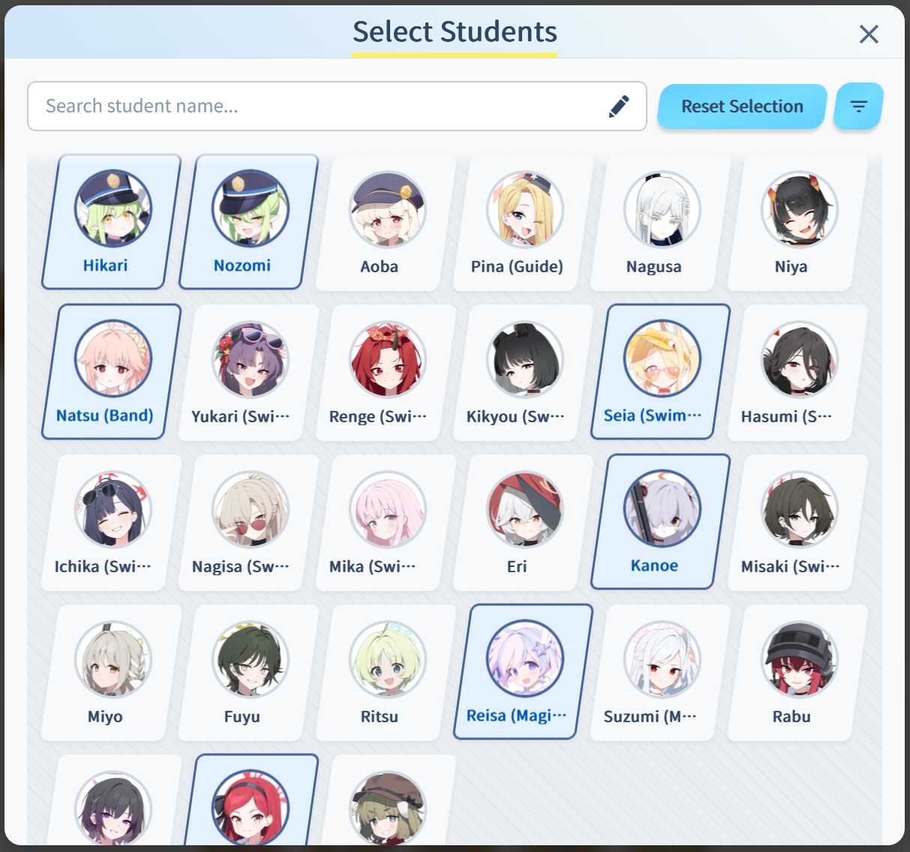
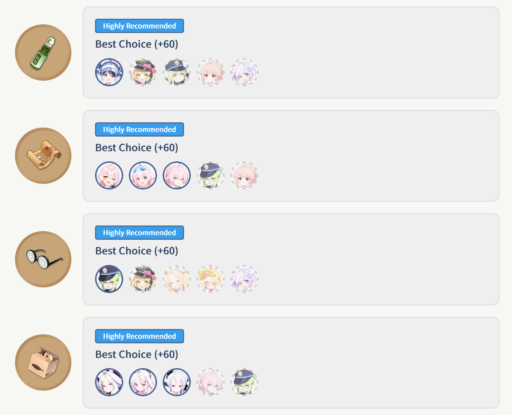
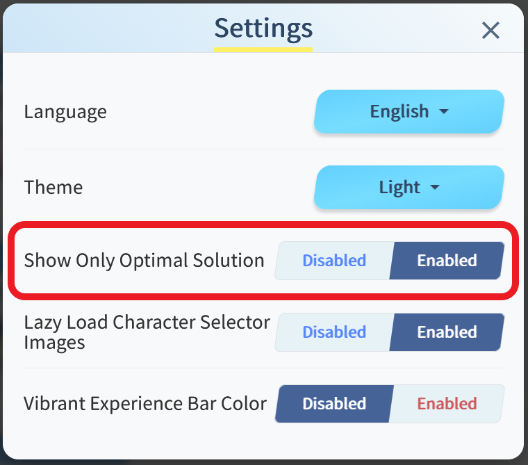
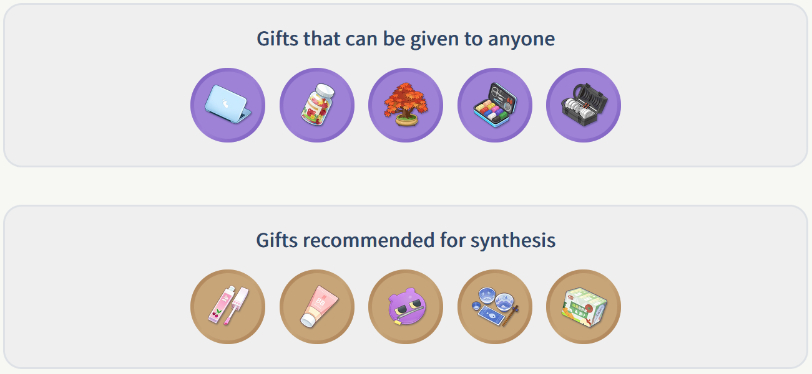
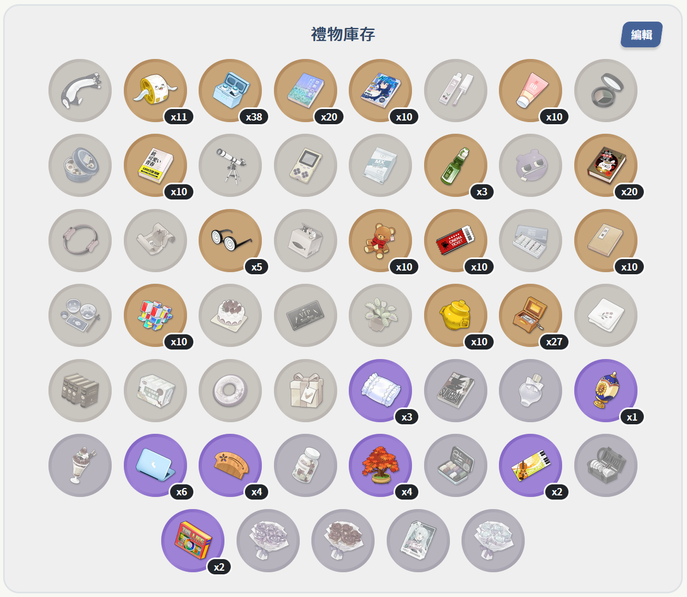
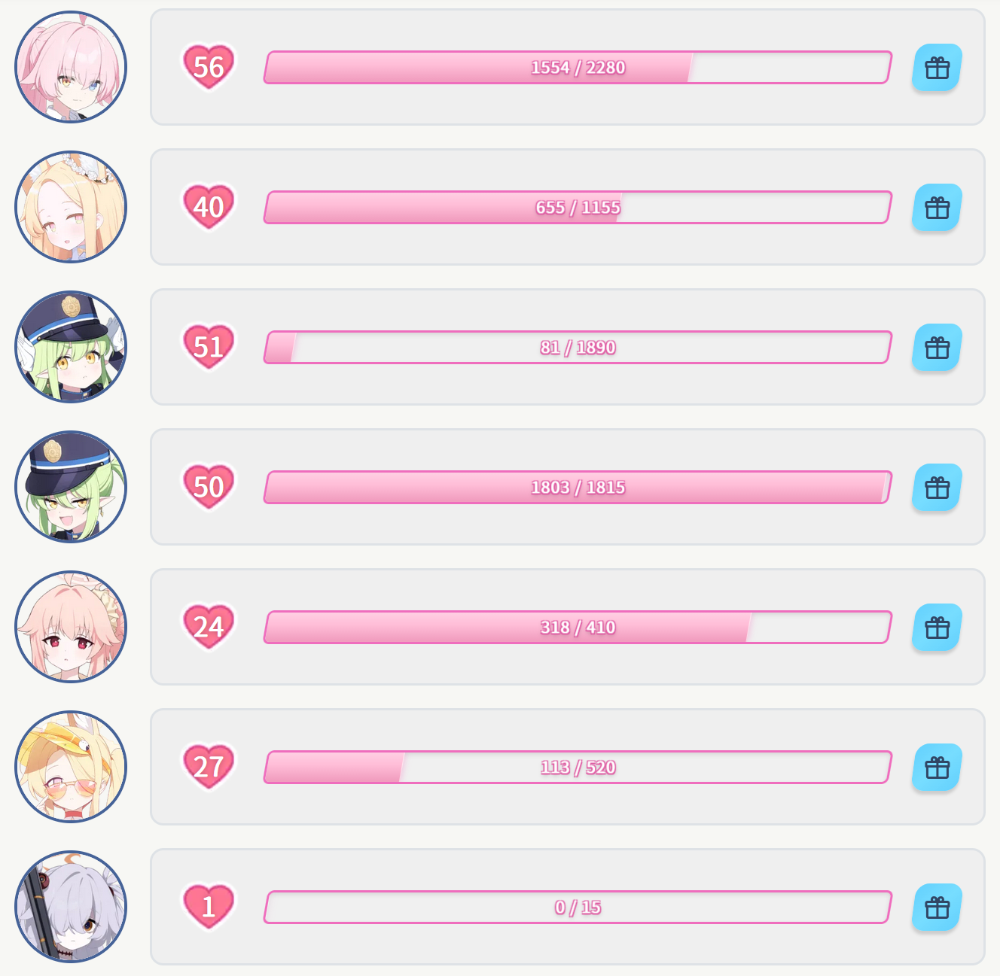
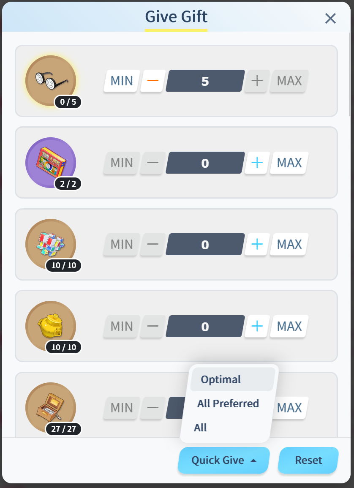
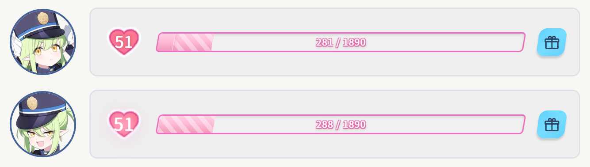
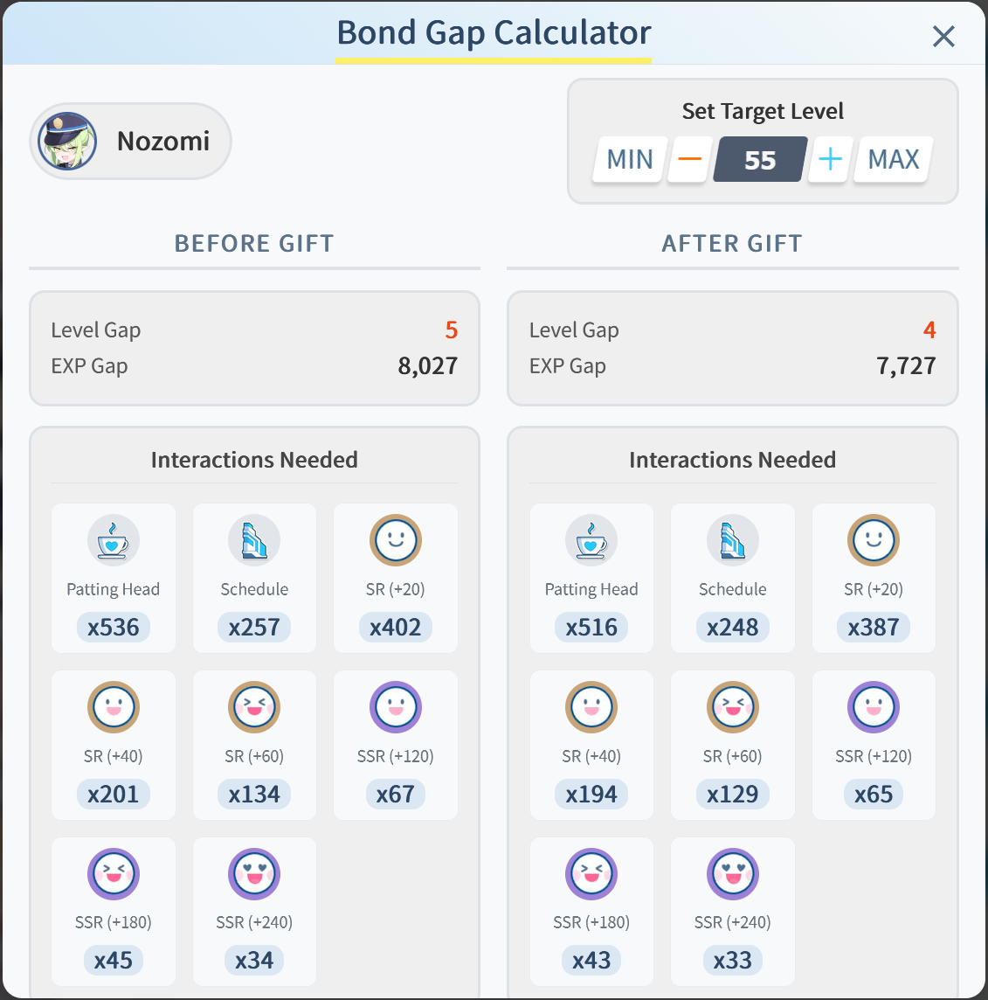

<p>
  <a href="../README.md">English</a> | 
  <a href="./README.zh-TW.md">繁體中文</a> | 
  简体中文 | 
  <a href="./README.ja.md">日本語</a> |
  <a href="./README.ko.md">한국어</a>
</p>

# BA Gift Planner - 蔚蓝档案礼物规划器

<p align="left">
  <a href="https://vuejs.org/"></a>
  <a href="https://vitejs.dev/"></a>
  <a href="https://opensource.org/licenses/MIT"></a>
</p>

这是一个为手游《蔚蓝档案》（Blue Archive）玩家设计的礼物规划器。项目使用 Vue 3 和 Vite 创建，提供一个简洁、快速且响应式的界面，帮助玩家快速从想提升羁绊等级的学生们中找到最优的送礼策略。本网站中使用的所有信息和素材均为各自作者的财产和版权。

**[➡️ 点此进入网站](https://ba-gift-planner.pages.dev/)**


> [!NOTE]
> 你可能会发现这个网站同时拥有 BA Gift Planner 以及 Sensei Harem Tool 两个名字，BA Gift Planner 为项目早期暂定的名称，目前还在考虑最终要统一使用哪个名字。

---

## ✨ 主要功能介绍

> [!NOTE]
> 目前网站支持英文、日文、繁体中文、简体中文和韩文。如果您希望帮助添加其他语言，请提交 [PR](https://github.com/Yuuzi261/BA-Gift-Planner/pulls)。

### 礼物推荐页面

1️⃣ 打开角色选择器，选好你的~~老婆😋~~...我的意思是学生



2️⃣ 关闭角色选择器查看结果（没错就是这么简单！），这里我只展示部份的结果



不是最佳选择的学生会有一个半透明+虚线边框效果，如果不想看到非最佳选择的结果，可以在设置界面中修改设置：



3️⃣ 查看哪些礼物可以任意赠送（SSR）或是拿去合成礼物自选箱（SR）



4️⃣ 好了，现在你可以打开游戏了开始和学生们培养感情了，再也不怕送错或是不知道哪些礼物可以拿去合成了！🎉

### 羁绊计算页面

1️⃣ 设置礼物库存



2️⃣ 设置学生羁绊等级、经验



3️⃣ 开始拟定赠礼计划



4️⃣ 可即时预览计划效果



5️⃣ 设置目标等级并查看差距



6️⃣ 实际应用计划


这些功能让计算羁绊变得简单，无论是想通过它随时同步游戏中的进度，严格进行好感度的规划；还是单纯设置一个差不多的数值看一下距离目标还有多遥远，抑或是想知道当下自己的礼物库存可以做到什么程度都很方便。

## 🛠️ 主要开发框架&套件

*   **前端框架**: [Vue 3](https://vuejs.org/) (Composition API)
*   **构建工具**: [Vite](https://vitejs.dev/)
*   **状态管理**: [Pinia](https://pinia.vuejs.org/)
*   **路由**: [Vue Router](https://router.vuejs.org/)
*   **代码风格**: [Prettier](https://prettier.io/)
*   **代码检查**: [ESLint](https://eslint.org/)
*   **部署平台**: [CloudFlare](https://www.cloudflare.com/)

## 🚀 本地开发

请确认您的电脑已安装 [Node.js](https://nodejs.org/)（建议版本 18.x 或以上）。

1.  **克隆项目**
    ```bash
    git clone https://github.com/Yuuzi261/BA-Gift-Planner.git
    ```

2.  **进入项目文件夹**
    ```bash
    cd BA-Gift-Planner
    ```

3.  **安装依赖**
    ```bash
    npm install
    ```

4.  **启动开发服务器**
    ```bash
    npm run dev
    ```
    启动后，浏览器将自动打开 `http://localhost:5173`。

5.  **构建项目**
    若要构建用于生产环境的文件，请执行：
    ```bash
    npm run build
    ```
    构建后的文件会存放在 `dist` 文件夹下。

### 项目脚本
 
| 命令 | 描述 |
| :--- | :--- |
| `npm install` | 安装项目所有依赖。 |
| `npm run dev` | 启动本地开发服务器，支持热重载。 |
| `npm run build` | 将项目打包至 dist 文件夹，并压缩 JSON 文件。 |
| `npm run preview` | 预览打包后的成果。 |
| `npm run format` | 使用 Prettier 格式化所有代码。 |
| `npm run lint` | 使用 ESLint 检查并修正代码风格问题。 |
<!-- | `npm run analyze` | 执行打包分析，产生 `stats.html` 报告。 | -->

## 📁 项目结构

```
BA-Gift-Planner/
├── public/            # 公共资源，不会被 Vite 处理
├── src/
│   ├── assets/        # 图片、字体、数据 JSON 等静态资源
│   ├── components/    # 可重复使用的 Vue 组件
│   ├── composables/   # 可组合的函数 (Hooks)
│   ├── data/          # 应用程序数据
│   ├── directives/    # 自定义指令
│   ├── locales/       # i18n 语言文件
│   ├── router/        # Vue 路由配置
│   ├── store/         # Pinia 状态管理
│   ├── utils/         # 共用工具函数
│   ├── views/         # 页面组件
│   ├── App.vue        # 主组件
│   ├── main.js        # 应用程序入口点
│   └── style.css      # 全局样式
├── .env               # 全局变量
├── .prettierrc.json   # Prettier 配置文件
├── eslint.config.js   # ESLint 配置文件
├── index.html         # HTML 入口文件
├── package.json       # 项目依赖与脚本
└── vite.config.js     # Vite 配置文件
```

## 🤝 贡献与协助

本项目非常欢迎社区的贡献，不论是协助数据更新、错误回报、新增语言支持或提供建议等。

你可以透过以下方式协助我们：

*   在 [Issues](https://github.com/Yuuzi261/BA-Gift-Planner/issues) 中提出问题及建议。
*   在 [Pull Request](https://github.com/Yuuzi261/BA-Gift-Planner/pulls) 中提交缺失的角评数据或代码修改。

## 📄 授权

本项目采用 [MIT License](https://opensource.org/licenses/MIT) 授权。
